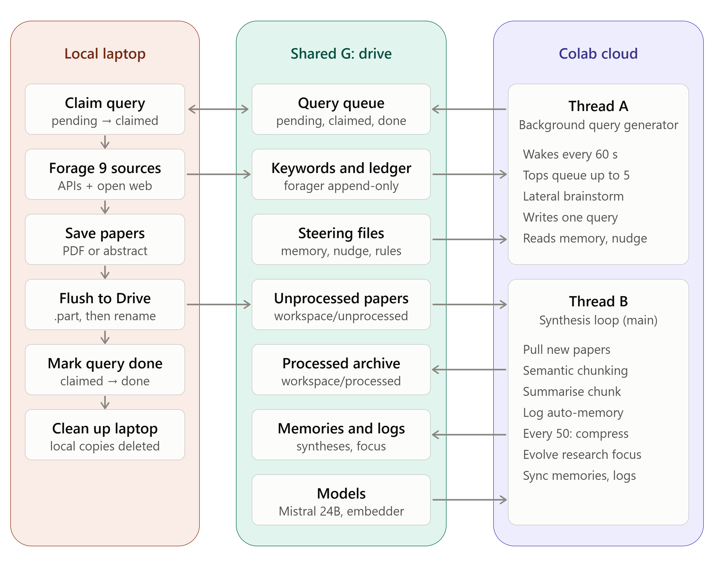

# Autonomous Research Assistant, Cloud and Laptop Based

## Introduction

This is a literature-synthesis and search-query-generation application, for any research field.  Both the cloud local components can be run simultaneously, separately, occasionally or never.  Heavy compute runs in Google Colab, while open-web and academic-database searching runs on a local machine with an internet connection. The two never talk to each other directly, rather, a shared Google Drive folder acts as a 'dead-drop' between them.  The LLM model is comparatively small, so documents are broken into chunks before they are summarized.  The documents are divided into *semantic chunks*,  in that way, similarity is measured, so a break would occur between the methodology and results sections.

**One full cycle looks like this:**

1. The **cloud agent** starts by utilizing the *Broad interests*, for the lens through which it reads papers and generates queries.  
2. The **local forager** searches using those queries, and drops the papers it finds back onto Drive.  
3. As the agent reads and the forager searches, a *Research focus* emerges and continually evolves.  
4. Then, **cloud agent** utilizes the *research focus* which has developed, as the lens through which it reads papers and generates queries.

---

## Architecture

| Node | Notebook | Runs on | Job |
| :---- | :---- | :---- | :---- |
| **Setup** | `agenticSetup.ipynb` | Colab (once) | Creates the Drive folders, writes the steering files, downloads the models |
| **Cloud – Thread A** | `cloudAgent.ipynb` | Colab (background) | Query generator: tops the queue up to 5 queries, checking every 60 s |
| **Cloud – Thread B** | `cloudAgent.ipynb` | Colab (main) | Synthesis loop: chunk → summarise → compress → evolve focus |
| **Local** | `localForager.ipynb` | Your PC | Forager: claims queries, searches, saves papers, marks queries done |
| **Bridge** | – | Google Drive | Shared storage |

---

## Directory tree (Google Drive)

PhD-research-assistant/

├── models/                              ← written by setup

│   ├── mistral-small-24b.gguf           (\~14.3 GB, synthesis model)

│   └── local-embed.gguf                 (\~0.4 GB, embedding model)

│

├── personality/

│   ├── MEMORY.md                        ← research profile; "Research Focus" is rewritten by the cloud agent

│   ├── INSTRUCTIONS.md                  ← task instructions for each synthesis

│   ├── NUDGE.md                         ← theme every generated query should favour

│   │

│   ├── memories/                        ← written by Thread B

│   │   ├── compiled\_memories.md         one "Auto-Memory" sentence per chunk

│   │   ├── meta\_synthesis\_\<time\>.md     every 50 sentences compressed into themes

│   │   └── evolved\_research\_focuses.md  history of every focus update

│   │

│   ├── logs/                            ← written by Thread B

│   │   └── log\_\<session\>\_\<time\>.md      full chunk \+ synthesis for each summary

│   │

│   └── queries/

│       ├── pending/                     ← Thread A writes \<time\>\_\<hash\>.md here

│       ├── claimed/                     ← forager moves a query here while working on it

│       ├── done/                        ← forager moves it here when finished

│       ├── harvested\_keywords.md        concepts from OpenAlex / Semantic Scholar metadata

│       ├── foraged\_papers\_ledger.md     every file name ever saved (prevents re-downloads)

│       └── forage\_\<time\>.md             per-query search log (saved / skipped / failed)

│

└── workspace/

&nbsp;&nbsp;&nbsp;&nbsp;├── unprocessed/                     ← forager drops papers here (.pdf / .md)

&nbsp;&nbsp;&nbsp;&nbsp;├── temp-chunks/                     ← \<paper\>\_chunk\_\<n\>.md awaiting synthesis

&nbsp;&nbsp;&nbsp;&nbsp;└── processed/                       ← papers already chunked (also used for brainstorming)

Both machines also keep temporary local copies. The forager deletes its local copy when it finishes each run.

---

## Requirements

- **Google account** Open a free 'gmail' account, which starts a Google account; one benefit is a G Drive.  
- **Google Colab** The free tier gives you access to the necessary GPU, but the paid plan is much better.  Colab and the G Drive can pass data between them.  
- **Google Drive for desktop** installed on your local machine, so the Drive folder appears as a local path (e.g. `G:/My Drive/`).  
- **Python 3.10+ with Jupyter** Install Python and Jupyter notebook on your local machine, using the instructions provided in `SETUP_PYTHON_&_JUPYTER`.

---

## How to use it out of the box

### 1\. `agenticSetup.ipynb` (run once, in Colab)

- Open the notebook in Colab, choose 'High-RAM' and click `Run all` cells. Approve access to your Google drive when prompted.  
- To change the starting research profile, edit the `MEMORY`, `INSTRUCTIONS` and `NUDGE` text in section 3 **before** the first run.  
- Setup only writes these files **if they don't already exist on Drive**.

### 2\. `cloudAgent.ipynb` (run whenever you want synthesis, in Colab)

- Select **Runtime → Change runtime type → T4 GPU, High-RAM**, then `Run all` cells and keep the browser tab open.  
- The two threads run together:  
  - **Thread A (background query generator)** brainstorms lateral concepts from processed papers, then writes a new query whenever `pending/` holds fewer than 5\.  
  - **Thread B (synthesis loop)** pulls new papers, splits them into semantic chunks, and writes one summary sentence per chunk. Every 50 summaries it compresses them into themes and updates the **Research Focus** in `MEMORY.md`.  
- Memories and logs are pushed to Drive whenever the local chunks run out, and at least every 50 minutes.  
- **Expected at startup:** a few `model 'mistral-small-24b' not found (404)` messages. Thread A starts before the model has finished loading. They stop once you see `successfully ingested and ready`.

### 3\. `localForager.ipynb` (run as often as you like, locally)

- Set `DRIVE_DIR` in section 2 to your Drive for desktop path.  
- Run the notebook. It:  
  1. moves the oldest query from `pending/` to `claimed/`;  
  2. searches DuckDuckGo, OpenAlex, Semantic Scholar, arXiv, CORE, Zenodo, OSF Preprints, HAL and DOAJ (`LIMIT = 2` results per source);  
  3. saves full text where it can, or the abstract where it can't, to `workspace/unprocessed/`;  
  4. moves the query to `done/`;  
  5. repeats until the queue is empty, then deletes its local working folders.  
- Only papers published from `YEAR_FROM` (default 2021\) onward are kept. Set `MAX_QUERIES_PER_RUN` to stop early.

---

## Where to read the results

| File | What it gives you |
| :---- | :---- |
| `memories/meta_synthesis_*.md` | Thematic bullet points: **start here** |
| `memories/evolved_research_focuses.md` | How the research focus has shifted over time |
| `memories/compiled_memories.md` | The most recent one-sentence insights not yet compressed |
| `logs/log_*.md` | The original chunk and full reasoning behind each insight |
| `queries/forage_*.md` | What each search found, skipped or failed to fetch |

---

## Personalizing it

It is an autonomous agent, guided by the literature.  So, it develops a research focus from what you give it to read.

---

## Responsible use

Respect each source's terms of service and rate limits. The forager already waits between requests and backs off when rate-limited; please don't reduce those delays. Downloaded papers are for your own research use.

---

## Extending the codebase with AI help

1. Back up your working notebooks.  
2. Upload all three notebooks and ask the assistant to explain the codebase, so it understands the context.  
3. Give it goal-oriented requests that reuse the existing patterns. For example:

*"Write a new `AcademicForager` subclass that uses the YouTube Transcript API to save transcripts for the search query. Follow the existing `download_document()` flow, and write files as `.part` then rename, with `_retry()` around Drive operations."*

4. Test changes on a single query (`MAX_QUERIES_PER_RUN = 1`) before a full run. AI-assisted programming is iterative.
